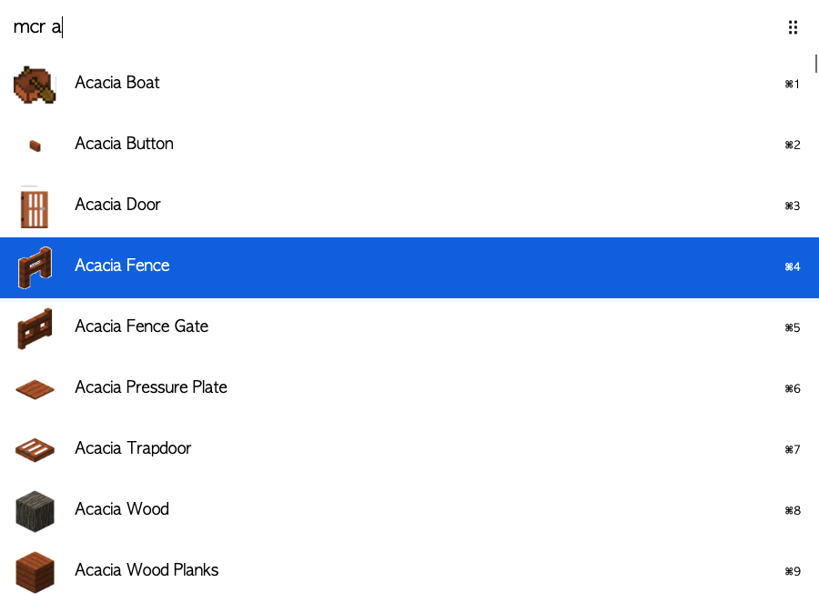

# arvis-minecraft-recipe

> arvis workflow to browse minecraft recipes using Quick Look.

## Install

``
$ npm install --global arvis-minecraft-recipe
``

## Usage

In arvis, type `mcr`, <kbd>Enter</kbd>, and the name of your block.

To view a recipe, press shift whilst the item is highlighted.  
You can also view the item in your default image viewer by selecting it.

## 🔗 This workflow is converted from [alfred-workflow](https://github.com/darfink/alfred-mcr).

* Note that there might be some code change or different actions from the original workflow.

* Marked original workflow's creator to author.
